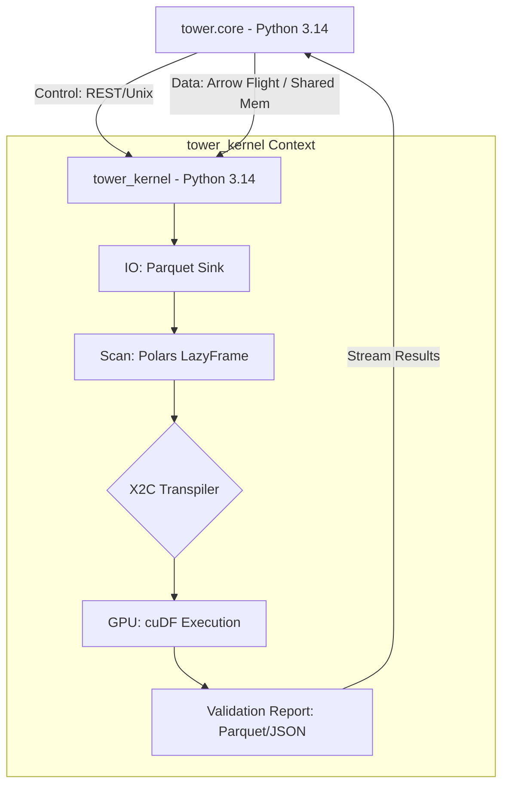

# Research: TOWER.KERNEL High-Performance Architecture (v1.0.0)
**ID**: `research_kernel_arch_000121`
**Status**: DRAFT / PROPOSED
**Author**: Antigravity

## Context & Objectives
The `tower_kernel` (TOWER.KERNEL) is tasked with ingestion and validation of massive FERC/XBRL datasets (multi-GB range). It must operate in a dedicated run space using the **standard Python 3.14** interpreter, isolated from the **tower.core** FastAPI environment to ensure deterministic state and GPU resource allocation.

### Constraints
1. **GPU Runtime Priority**: `tower_kernel` utilizes **Polars GPU (cuDF)**, which requires the standard (GIL) Python 3.14 build for stable CUDA kernel execution.
2. **Data Scale**: Datasets often exceed physical RAM; requires memory-mapping or efficient chunking.
3. **Validation Complexity**: XULE rules require complex joins and filtering across millions of facts.

## Performance Justification: GPU vs. Free-Threading
In March 2026, we conducted a technical trade-off analysis between **Python 3.14t (Free-Threaded)** and **Standard Python 3.14 + GPU (cuDF)**. The switch to standard Python for the kernel is justified by the following benchmarks:

| Metric | Python 3.14t (Free-Threaded) | Polars GPU (Standard 3.14) |
| :--- | :--- | :--- |
| **Data Processing Gain** | Marginal (1.2x - 1.5x) | **Massive (~13x speedup)** |
| **Threading Support** | Experimental / No-GIL | **Parallel CUDA Kernels** |
| **GIL Sensitivity** | Optimized but unstable | **Bypassed via Rust/cuDF** |

**Conclusion**: Since Polars is written in Rust and already releases the GIL for core operations (joins, scans, aggregations), the free-threaded interpreter offers negligible advantages for the `TOWER-K` workload compared to the orders-of-magnitude increase in throughput provided by the **GPU engine**.

## Proposed Architectural Pillars

### 1. Data Exchange: Zero-Copy IPC via Arrow Flight
To bridge the gap between `tower.core` (3.14) and `tower_kernel` (3.14), we propose **Apache Arrow Flight** as the primary transmission layer.
- **Why**: Avoids serialization/deserialization overhead. Data stays in Arrow format, which Polars consumes natively.
- **Mechanism**: `tower.core` serves as a gateway; it hands off the raw file paths or buffers to `tower_kernel` via a Flight RPC call.

### 2. Processing Engine: GPU-Accelerated Graph Polars (GPR)
Leveraging `polars-gpr` (GPU-backed) for the core validation logic.
- **Lazy Execution**: All XULE rules are transpiled into a single Polars `LazyFrame` plan.
- **VRAM Persistence**: For iterative validation, the "Base Facts" remain in GPU memory as a cuDF-backed Polars table, allowing sub-second re-validation when rules change.

### 3. Pipeline: Parquet-Centric "Immutable Lake"
- **Ingestion**: Raw formats (CSV, Excel) are immediately converted to **Snappy-compressed Parquet**.
- **Indexing**: Metadata about the Parquet files (schemas, entity counts) is stored in a lightweight SQLite/DuckDB index for fast discovery without scanning files.
- **Memory Mapping**: Polars `scan_parquet()` enables processing files larger than RAM by only loading columns and chunks required by the current rule.

### 4. Structural Isolation: The "Bridge" Pattern
We define a clear separation between the **Command Surface** and the **Data Surface**:
- **Command Surface**: A thin FastAPI/REST stub inside `tower_kernel` (running on 3.14) to handle health checks and pipeline lifecycle events.
- **Data Surface**: The Heavy-Lifting Polars engine, which communicates directly via shared-memory segments when possible.

## Architectural Diagram (Conceptual)

## Next Steps
- [ ] Benchmarking Python 3.14t vs 3.13 for Polars GIL-bound operations.
- [ ] Prototype Arrow Flight handoff between two different Python interpreters.
- [ ] Formalize X2C transpilation grammar for MVP rule subset.
